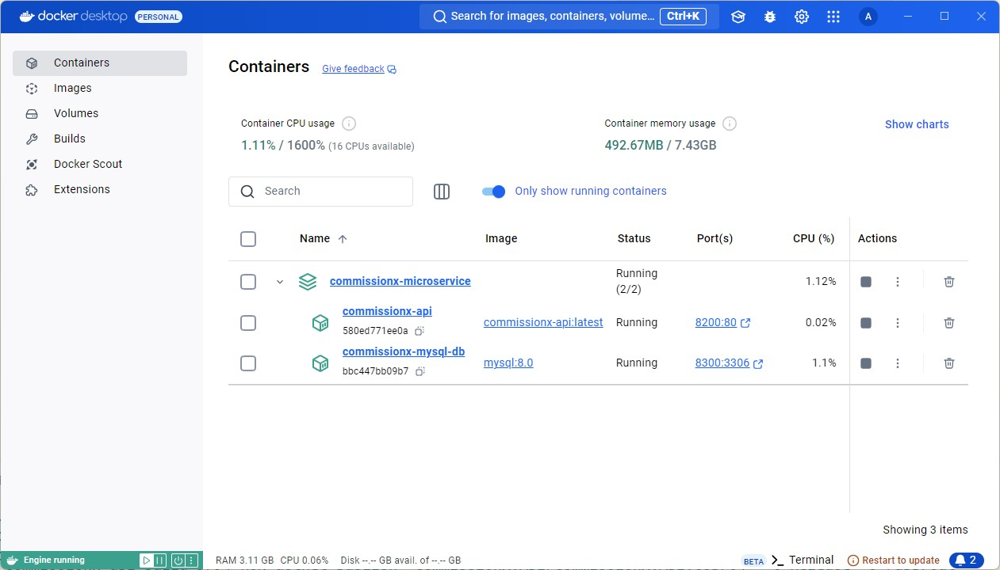
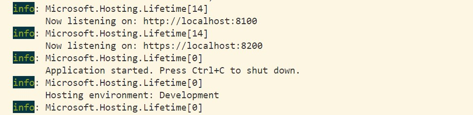
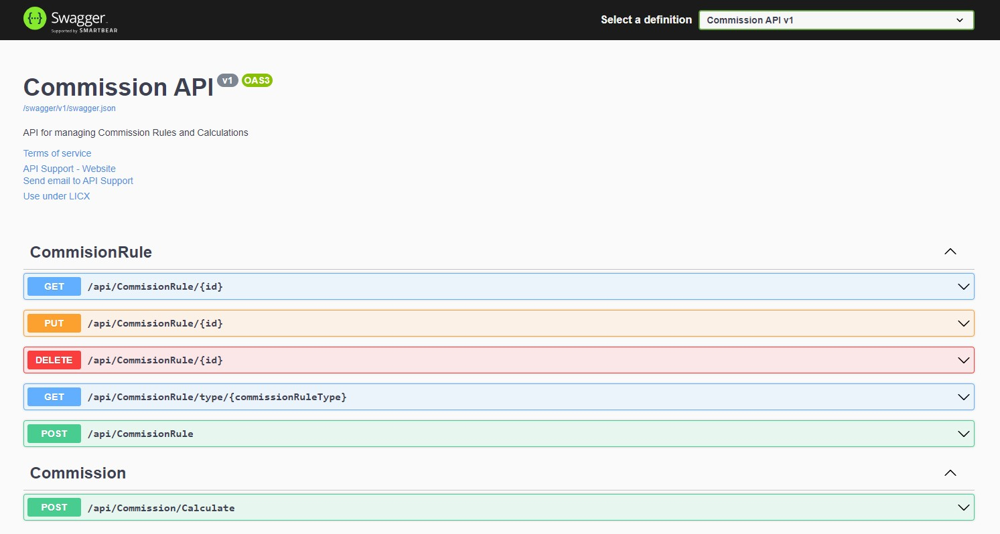

# CommissionX.Api

CommissionX.Api is a microservice designed to handle commission calculations using the CQRS (Command Query Responsibility Segregation) pattern. The service supports different
commission types such as Flat, Percentage, Tiered, Combination, and Cap. The project is built using .NET Core, Docker, and MySQL for data persistence.

## Project Structure

The solution is divided into multiple projects to support a clean architecture pattern:

1. **CommissionX.Api** - The API layer that handles HTTP requests and orchestrates application services.
2. **CommissionX.Application** - Contains application logic, CQRS pattern implementations (Commands, Queries, Handlers), and DTOs.
3. **CommissionX.Core** - Core domain entities such as `Invoice`, `SalesPerson`, `CommissionRule`, etc.
4. **CommissionX.Infrastructure** - Infrastructure layer for database contexts and persistence configuration (MySQL).

## Technologies Used

- **.NET Core 6**
- **CQRS Pattern**
- **Entity Framework Core 6**
- **Docker**
- **MySQL**
- **Docker Compose**

## Getting Started

### Prerequisites

- Docker and Docker Compose installed on your machine.
- .NET Core 6 SDK installed.

### Running the Application

1. Clone the repository:

   ```bash
   git clone https://github.com/arunap/CommissionX.git
   cd CommissionX
   ```

### Build and Run (Option 1 - Docker, MySql)

1. Open a terminal and navigate to the root directory of the project.

2. Run the following command to build and start the containers:

   ```bash
   docker-compose up --build
   ```

   This command will build the images and start the containers defined in `docker-compose.yml`.



3. To stop the running containers, use:

   ```bash
   docker-compose down
   ```

### Build and Run (Option 2 - In-Memory Database)

1. Navigate to the `CommissionX.Api` directory of the project.

2. Open `appsettings.json` file and set `UseInMemoryDatabase=true`

3. Run the following command on the terminal in `CommissionX.Api`

   ```bash
   dotnet run
   ```

   

### Access the Application

- **Backend (API)**: The API will be available at `http://localhost:8200/swagger`.
- **MySQL Database**: Will be available at port `8300` server `127.0.0.1`.


